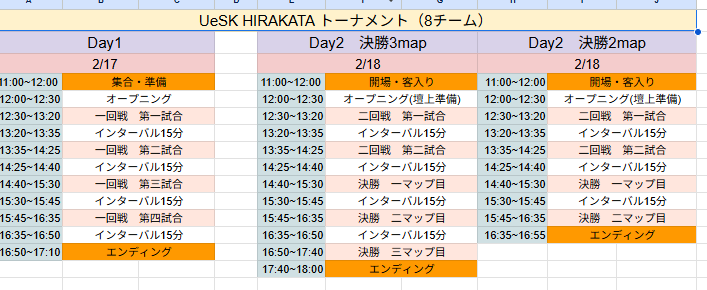
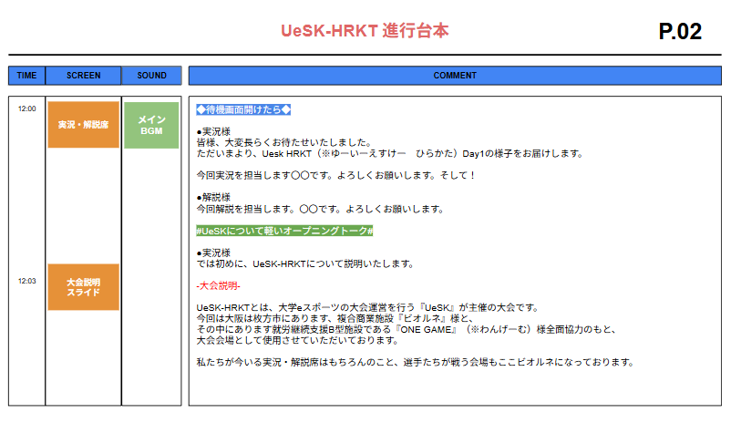
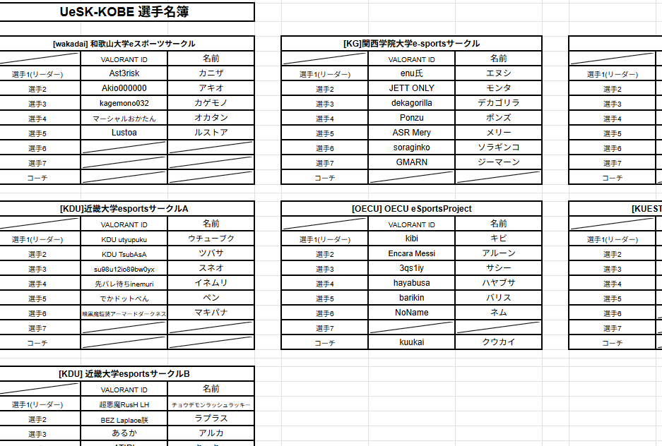

# 実況解説補助とは

esports大会の配信で、視聴者を盛り上げるために欠かせないのが 実況・解説（キャスター） の存在です。

しかし、キャスターは大会の内部進行や裏側の状況をリアルタイムで把握することができないため、キャスターを支える運営の補助業務が非常に重要 になります。

---

## 1.事前準備で行うこと（大会前）

キャスターが安心して話せるよう、以下の資料を事前に共有します。

### 提供する資料

・進行台本（MC台本） 
大会の流れ、どこで何を話すか、紹介順などが書かれているもの。

・選手名簿・チーム情報 
事前インタビューや注目選手のポイントがあるとさらに良い。

・香盤表（試合スケジュール） 
何時にどの試合が行われるか、配信で映す試合の順番など。

・大会ルールの概要 
注目ポイントや特別ルールがあれば事前に説明。

・マッププール・BAN/PICKの流れ（必要な場合） 

### 事前ミーティング（読み合わせ）

キャスターと運営で以下を確認します。

・大会全体の流れ 

・台本の読み合わせ（MC入り・エンディングの案内など） 

・話すべきポイントの共有 
┗ 例：注目チーム、見どころ、インタビュー内容

・配信で映す試合と、注目選手の確認 

事前に打ち合わせすることで、当日キャスターが迷わずスムーズに話せる環境を作ります。

## 2.大会当日のキャスター補助

大会当日、キャスターは基本的に 配信席から動けず、会場全体のトラブルや進行状況を把握することができません。

そのため、運営がキャスターに対して リアルタイムの情報提供を行う必要があります。

### 運営が行うキャスターサポート

#### カンペ（指示カード）で情報を提供

キャスターが瞬時に理解できるよう、運営はカンペやモニター上のチャットで情報を共有します。

#### カンペの内容例

- 配信開始までのカウントダウン 
「10秒前」「5秒前」「スタート！」など。

- 進行状況の共有 
「マップBAN中」「試合開始まで2分」「選手準備中」など。

- トラブル情報 
「選手PC不具合」「マウス交換中」「回線トラブル」など。

- 時間調整の指示 
「押しています → 会話を短めに」 
「巻いてください」 
「時間が余っています → トピック1つ追加で」 など。

- 選手入場や企画コーナーの準備完了報告

#### 必要に応じて追加で行うこと

・キャスターへ最新の試合結果を随時共有

・インタビューの開始タイミングの指示

・ハイライトの準備状況を伝える

・キャスターが間違った情報を話した場合、訂正のカンペを出す

## 3.キャスター補助の必要性

キャスターは配信の顔であり、大会の雰囲気・世界観を視聴者に伝える役割があります。 
しかし、

- 裏の情報がわからない

- トラブルが知れない

- 予定の変更に気づけない

こういった状況では、どれほど技術があるキャスターでも対応が難しくなります。 
運営が裏から情報を適切に渡し続けることで、キャスターはベストなパフォーマンスを発揮でき、配信全体のクオリティが大きく向上します。

