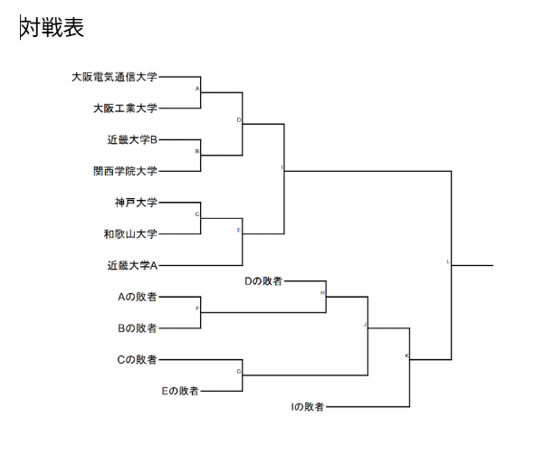

# 競技に関する準備

競技に関する準備は、大会全体の“骨組み”を作る最も重要な工程です。

エントリーが締め切られ、参加チーム数が確定した段階で、以下の作業を行います。

---

## トーナメント形式の制定・制作

エントリー締切後、
「参加チーム数 × 会場の利用可能時間」 をもとに、どの形式が適切か判断します。

主なトーナメント形式（3種類）

### 1.グループ総当たり → 決勝トーナメント

- 3~5チームごとにグループを作り、全チームが複数の試合を行える形式
- “参加者満足度が高い”が、“時間と会場コストが重い”
- 観客にも分かりやすく、配信向き

適合状況：
- 参加チーム数が少ない大会
- 学生大会の交流戦形式

### 2. シングルエリミネーション

- 一度負けると敗退
- 最もシンプルで時間を読みやすい
- 大規模大会でよく使われる

適合状況：
- 時間が限られる会場
- スタッフ経験が浅い大会でも運営しやすい

### 3. ダブルエリミネーション

- 負けても「敗者側ブラケット」から再挑戦可能
- 競技力が反映されやすく公平性が高い
- ただし、試合数が倍近く増えるため時間管理が難しい

適合状況：
- プロ・準プロ向け
- 配信映えを重視する大会
- 1日ではなく複数日開催

## 全体スケジュールの作成

試合形式が決まれば、次は細かいタイムテーブルを決めます。

基本的なスケジュール項目

- 集合時間
- 受付開始・終了
- 配信開始
- オープニング（選手紹介・大会説明など）
- 試合開始
- ラウンドごとのゲーム開始予定時間
- 休憩時間
- 決勝の開始時間 / 終了予定
- 表彰式
- 配信終了時間
- イベント終了・退出時間

## 余白時間（バッファ）を必ず設定する

### バッファとは？

バッファとは、スケジュールの余白時間のことを指します。

実務的に最も重要なポイントです。 
なぜバッファが必要か？

大会では必ず以下のような遅延が起きます。

- 選手の遅刻
- トラブル（デバイス・回線・ゲーム内バグ）
- 配信の映像/音声トラブル
- ゲームの進行遅れ
- 予選の試合が長引く

そのため、スケジュール通りに進む前提で組むのは絶対にNG。

例：オープニングの時間設定

実際は20分で終わる、しかしスケジュールも20分にすると… 
→ 遅延が即、その後の試合に波及する

### 正しい設定方法
オープニングは 30分 と書く（10分の余裕を確保） 
この「10分の余白」が、後の大きな遅延を防ぐカギになります。

### バッファを特に多く取るべきポイント
- 試合の切り替え
- 敗者側の試合進行（ダブルエリミネーション）
- 決勝戦前の調整
- 配信トラブル対応
- 表彰式前後

## 作成したスケジュールは運営全体で共有する

スケジュールは作って終わりではありません。

**必ず共有すべき相手**
- 配信チーム
- 競技チーム
- 会場スタッフ
- MC / 解説
- 本部責任者
- 選手全体（Discordなどで告知）

特に配信チームと競技チームがスケジュールを理解しているかが超重要。
この2つが噛み合わないと、大会が崩壊します。

## 最終調整

### レギュレーションの最終調整

- 試合形式
- マップルール
- 遅刻時の扱い
- 不戦敗ライン
- 禁止事項（煽り行為・バグ利用など）

### 競技チームの配置

- 何試合同時進行するのか（総当たり戦）
- 選手呼び出しの担当
- 全体進行の担当

