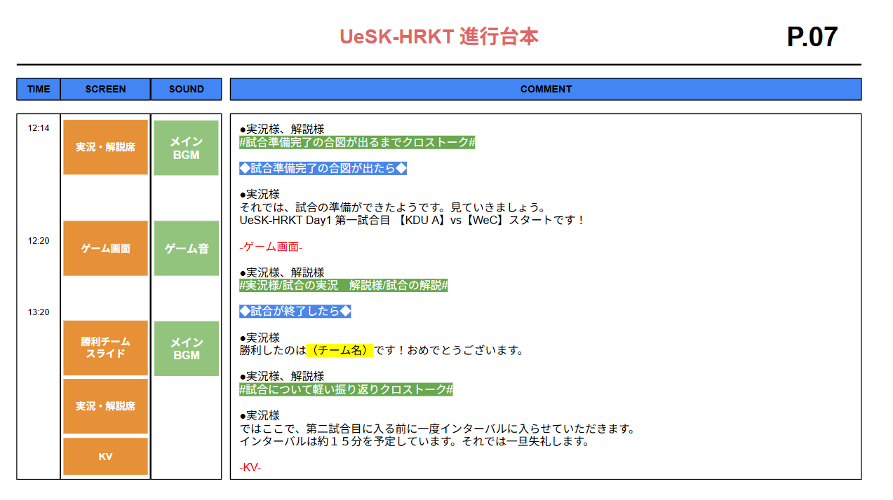

# 本部（プロジェクトマネジメント）

本部は、大会運営における中枢を担うチームであり、大会全体の方向性と進行を統括する役割を持つ。

いわば「大会全体のプロジェクトマネージャー」として、各運営チームの状況を把握し、適切な判断と指示を行うことが求められる。

## 1.団体全体の進行管理

本部は、大会準備から当日、事後対応に至るまでの全体スケジュールを管理する。

各工程が計画通りに進んでいるかを定期的に確認し、遅れや問題が生じている場合は、早期に修正を行う必要がある。

注意点

- 各チームの「作業完了予定日」と「実際の進捗」を必ず区別して把握する
- 遅れが出た場合は、原因を責めるのではなく、リカバリー方法を即座に考える姿勢が重要
- 自分の作業を後回しにしてでも、全体を優先して確認する判断力が求められる

## 2.全チームの進捗確認・連携調整

競技運営、配信、会場、広報など、複数のチームが同時進行で動く中で、本部はそれらを横断的につなぐ役割を担う。

各チームが単独で最適化されていても、全体として噛み合っていなければ大会は成立しない。

注意点

- 情報の伝達漏れが最も起こりやすいポジションである
- チーム間で認識がずれていないか、必ず言語化して確認する
- 「聞いていない」「知らなかった」を防ぐため、決定事項は文章で共有する

## 3.大会全体の構成整理・台本（香盤表）の作成

本部は、大会の流れを一つのストーリーとして設計する役割を持つ。

開会式、試合進行、配信演出、休憩時間、表彰式までを時系列で整理し、台本・香盤表として落とし込む。

### 【台本について】

台本作成において最も意識すべき要素は「タイミング」である。

台本というと、演者が話すセリフを中心に記載するものだと考えられがちだが、 
実際に大会進行の成否を分けるのは、映像・音響・照明・演者の動きが噛み合う“時間の設計”である。

例えば、

- 「このセリフをきっかけに照明が切り替わる」
- 「BGMが変わったら次の演出に移行する」
- 「このコーナーを○分進行したら次のコーナーへ入る」

といったポイントは、できる限り具体的に台本へ記載する。

感覚的には、映像／音響／照明などのタイミング指定が6割、セリフの記載が4割程度の比重になることが多い。

台本内のセリフについては、大会名、スポンサー紹介、選手名や登場順など、間違いが許されない情報を中心に明確に記載する。

一方で、試合中の実況や解説などについては、演者の裁量に委ねるケースも多く、制作チームと演者の信頼関係が構築されている場合には、

- 「良いタイミングでコメント」
- 「複数回発生したら次へ」

といった、あえて抽象的な指示が入ることもある。

台本の流れが固まった段階で、まず行うべきことは文言の徹底チェックである。

誤字脱字はもちろん、表記ゆれ、スポンサー名や選手名、チーム名などを細部まで確認し、トラブルの芽を事前に摘む。

台本が完成したら、技術チーム（映像・音響・照明）および演者とのすり合わせを必ず行う。

台本の文字情報だけでは伝わらない、細かなタイミングや演出意図、ニュアンスをここで共有する。

例えば、

- 演者は「画面が切り替わったら読む」と認識している
- 映像チームは「演者の一言を合図に画面を切り替える」と考えている

といった認識のズレがあると、ステージ上で無音の時間が生まれるなど、致命的な事故につながる。
こうしたすれ違いを未然に防ぐことも、本部が台本を管理する大きな役割の一つである。

注意点

- 理想的な進行だけでなく、「遅延が起きた場合の代替案」も想定しておく
- 競技進行・配信・MC・技術演出の動きを同時に考慮する
- 香盤表・台本は本部だけで完結させず、関係チームと必ずすり合わせる

## 4.トラブル発生時の最終判断・指示出し

大会当日は、想定外のトラブルが必ず発生する。

その際、本部は現場の状況を総合的に判断し、最終決定を下す責任を持つ。

注意点

- すべてを完璧に解決しようとしない
- 「大会全体への影響が最小になる選択」を優先する
- 現場スタッフの判断を尊重しつつ、最終責任は本部が持つ姿勢を示す

### 本部に求められる姿勢・考え方

本部は、最も情報が集まるポジションであると同時に、最も孤独になりやすい立場でもある。

制作物、会場、配信、競技ルール、広報状況など、すべてを把握しながら意思決定を行う必要がある。

そのため、以下の点が重要となる。

- 自分の意見を押し通すのではなく、情報を整理して判断する冷静さ
- 状況が変化しても柔軟に計画を修正できる思考力
- チーム全体の士気を下げない言葉選びと態度

### 人数構成と体制づくりのポイント

本部は 1〜3名程度 で構成されることが多い。

少人数であるからこそ、以下の点に注意する。

- 役割分担を曖昧にしない（進行管理／台本管理など）
- 情報が一人に集中しすぎないよう、必ず共有する
- 当日は「判断役」と「現場確認役」に分かれると負担が軽減される

## まとめ

本部は、大会を成功に導くための「司令塔」であり、すべての判断が大会の質に直結するポジションである。

完璧を目指すのではなく、状況に応じて最善を選び続けることが、本部に最も求められる役割である。