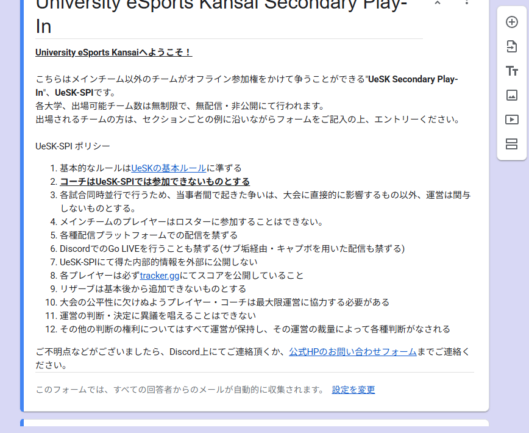

{/*  エントリーとは、今大会に参加してもらうのを確約してもらうものになります。

 以下は一連の流れになります

 エントリーフォームを公開 → 選手が確認する→各事項に同意ができれば回答を送信 → 大会への参加が確約
 
 なぜエントリー準備が重要なのか（掴み）*/ }

# エントリーフォーム並びにエントリー動線について

オフラインesports大会において、エントリーは大会づくりの出発点となる重要な工程です。

参加者を募集し、必要な情報を正しく集めることで、以下のメリットがあります。

    > - 試合形式を確定しやすい（参加チーム数・人数に合わせて構成できる）
    >
    > - 当日の混乱を防げる（選手情報を事前に把握し、誘導や受付がスムーズ）
    >
    > - トラブルリスクを減らせる（連絡手段やプレイヤー名の確認ができる）
    >
    > - 参加者との信頼関係を築ける（丁寧な案内は大会の質として評価される）

　学生大会では特に、連絡不足・記入ミス・当日欠席などが起こりやすいため、エントリーの設計がそのまま大会の安定感につながると言っても過言ではありません。

---

## エントリーフォームに必要な項目 

◆ 基本情報（チーム・個人情報） 

- チーム名 / プレイヤー名（正式名称）

    → 配信・トーナメント表・受付管理で使用するため必須

    → 大会期間中は統一必須

- 代表者名（本名）

    → 連絡窓口となるため、本名推奨。情報が一致しない事故を防ぐ。

- 連絡手段

　　- メールアドレス

　　- Discord ID（必須・大会運営が使用）

　　- X（Twitter）ID（任意）

        → 大会運営との連絡の98%はDiscordが主流

◆ メンバー情報（チーム制の場合）

- メンバー全員のゲーム内ID（正確に）

　　「フレンドコード」, 「#後ろのタグ番号」
　
    → 不正防止・照合のため必須

- 学年 / 所属大学（学生大会の場合は特に重要）

    → 学生証照合・重複参加防止に役立つ

- 当日の参加可否確認

- 「全メンバーが当日参加確定していますか？」チェック欄

    → 当日欠席トラブルを大幅に減らす

◆ 大会特有の確認事項

- 使用デバイス（マウス・キーボード・パッドなど）

    → 会場の設備準備に必要

- 機材の持ち込み有無（PC・デバイス）

    → オフライン大会では必須の確認

- 遅刻・無断欠席に関する同意欄

    → 不戦敗やペナルティに対する了承

- 大会規約への同意（チェック必須）

　　> 配信映像に映る可能性への同意

　　> 肖像権・大会公式素材への利用許可

　　> ハラスメント・暴言禁止

　　> 不正行為に対する罰則

        → チェックを必須化することで証拠にできる

◆ 大会概要（選手が確認すべき必須情報）

- 大会の目的

- 開催形式（オフライン／オンライン予選の有無）

- 参加条件（関西圏大学生・学生証必須 etc.）

- 日程・会場

- エントリー締切

- 大会関連リンク（ルールブック・Discord・HP）

- 名前統一の徹底

- 代表者はDiscord参加が必須

    → これらはフォーム冒頭で必ず明記

◆ 同意欄（チェックボックス項目）

- 大会ルールへの同意

- 大会規約・行動規範への同意

- 名前の統一に関する同意

- 遅刻や無断欠席に関する同意

- 連絡は代表者に集約することへの同意

◆ 運営側の管理項目（任意）

- 緊急連絡先（任意）

    → 事故・トラブル向け

- チームの参加目的（任意）

    → 大会の分析・マーケ施策に活用

- 備考欄（自由記述）

    → 食物アレルギー、障がい、特別対応など事前に把握

import Slideshow from '@site/src/components/Slideshow';

<Slideshow images={[
  require('./img/2025-11-27_222409.png').default,
  require('./img/2025-11-27_222341.png').default,
  require('./img/2025-11-27_222331.png').default,
  require('./img/2025-11-27_222319.png').default,
]} />

## まとめ

エントリーフォームは、単なる「応募フォーム」ではなく、大会のルールを参加者に理解してもらう最初の接点です。

記載項目を充実させることで、

- 当日の混雑や遅延を防げる

- 参加者のトラブルを最小限にできる

- 公平で安全な競技環境を実現できる

など、多くのメリットにつながります。