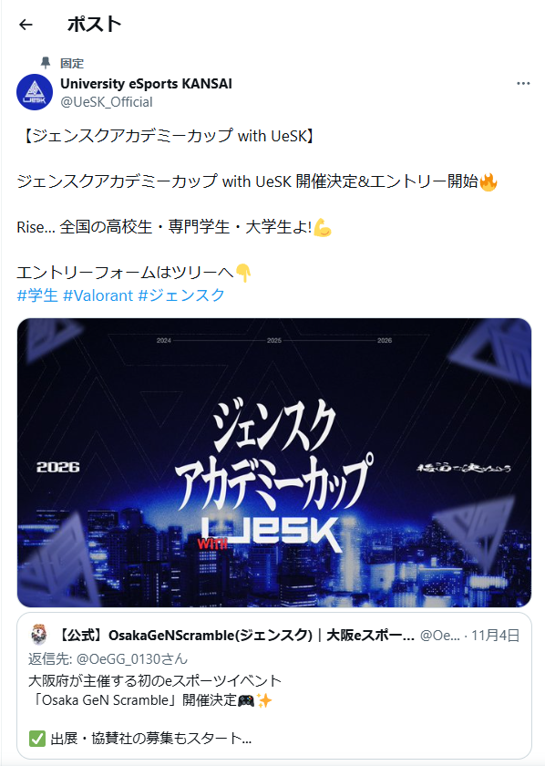

# SNS告知
SNS告知は、イベントの認知拡大と参加者確保に直結する重要な工程です。

特に大学生を対象としたeスポーツイベントでは、SNSの活用が最も効果的な広報手段となります。

---

## SNS告知の概要

まず、告知を開始する時点で、大会概要（日時・場所・競技タイトル・参加条件・エントリー方法）を明確に整理しておく必要があります。 
情報に不足や不明点があると、参加者からの問い合わせが増え、運営負担が大きくなるためです。

告知は、通常 1か月前〜3週間前 を目安に開始し、投稿内容は「認知→参加誘導→リマインド」の流れで段階的に構成します。

具体的には、第一報として大会の存在を広く知らせるビジュアル告知を投稿し、続いて参加方法や賞品情報など、興味を喚起する詳細を複数回に分けて発信します。

また、SNS告知では 視認性の高い画像や動画 を用いることで、投稿の拡散性が向上します。大会ロゴ、キービジュアル、過去大会の写真、トレーラー映像などを活用し、統一感のあるデザインで発信することが望ましいです。

投稿後は、エントリー数の推移を確認しながら、必要に応じて追加の告知やリマインド投稿を行います。特に大学間連携がある場合は、他団体のSNSや学内コミュニティとの協力を得ることで、さらに多くの学生へリーチすることが可能です。

最後に、SNSで寄せられた質問への回答も丁寧に行い、参加希望者が不安なくエントリーできるようサポートすることが大切です。

## 投稿計画（タイムライン）の策定

まずは全体の告知スケジュールを作成する。

基本スケジュール例
- 4週間前：大会告知（概要発表）
- 3週間前：エントリー開始告知
- 2週間前：追加情報（賞品・ゲスト・ルール）
- 1週間前：リマインド告知
- 前日〜当日：配信告知

Googleスプレッドシートなどで、「投稿日時／内容／担当者」を整理する。

## 投稿素材の制作

投稿に必要な素材を準備。

必須素材
- メインビジュアル（大会ロゴ入り画像）
- 大会概要画像（日時・場所・参加条件）
- エントリー案内画像（QRコード付きが好ましい）
- 進行表の簡易版(なくてもいい)
- 過去大会の写真や動画

## 投稿文の作成

読みやすく、疑問が生まれない文章を作成。

ポイントは次の3点：
- 結論（いつ・どこで何の大会か）
- エントリー方法（必ずURLと期限）
- 興味を引く要素（賞品、過去大会の成功例など）

投稿文のテンプレート化もおすすめです。